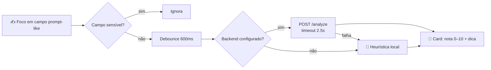

<div align="center">

# 📏 PromptMeter

**Uma nota 0–10 e uma dica curta para cada prompt, enquanto você digita.**
*A 0–10 score and a short tip for every prompt, as you type.*

[](https://developer.chrome.com/docs/extensions/mv3/intro/)
[](https://developer.mozilla.org/docs/Web/JavaScript)
[](#)
[](#)
[](#)

🇧🇷 [**Português**](#-português) · 🇺🇸 [**English**](#-english)

</div>

---

## 🇧🇷 Português
<a name="-português"></a>

### O que é

**PromptMeter** é uma extensão **Chrome (Manifest V3)** que avalia, **em tempo real**, o prompt que você está digitando em campos de IA — **ChatGPT, Claude, Gemini, Perplexity, Mistral Chat** e qualquer `textarea`/`contenteditable` grande na web. Logo abaixo do campo aparece um card com **nota de 0 a 10** e uma **dica curta (≤142 caracteres)**.

> **v0.3.0 — análise local por padrão, backend opcional.** Privacidade primeiro: com o endpoint vazio, **nenhuma requisição de rede é feita**.

### O problema que resolve

A qualidade da resposta de um LLM depende quase tudo do prompt — mas a maioria das pessoas escreve no piloto automático. O PromptMeter dá **feedback imediato e contextual** sobre estrutura, contexto, exemplos e formato de saída, ajudando a melhorar o prompt **antes** de enviá-lo, sem trocar de ferramenta.

### Recursos

- 🎯 **Detecção inteligente de campo:** `textarea`, `contenteditable` e `input` de texto "grandes"; suporte a **Shadow DOM** (`composedPath`), **iframes** (`all_frames`) e **SPAs** (polling de rota).
- 🔒 **Ignora campos sensíveis:** `password`, `email`, `tel`, `cc-*`, `otp`, `one-time-code` e qualquer campo em formulário com senha.
- 🧠 **Análise local heurística** (offline, gratuita, privada): comprimento útil, estrutura, verbos imperativos, papel/contexto, exemplos, formato de saída, especificidade, audiência, ambiguidade, CAPS, repetição.
- ☁️ **Backend opcional:** define a URL nas Opções → `POST {url}/analyze` (timeout 2,5s); se falhar, **cai automaticamente** na análise local.
- 📊 **Cota diária** (free: 30/dia), idempotência por hash **FNV-1a**, e **falhas não consomem cota**.
- 🔕 **Silenciar por site** e `Esc` para esconder; **i18n PT-BR (default) + EN**.

### Como instalar (modo desenvolvedor)

```
1. Abra chrome://extensions/ (Chrome / Edge / Brave)
2. Ative "Modo do desenvolvedor"
3. "Carregar sem compactação" → selecione a pasta PromptMeter_MVP_Sprint1/
4. O ícone aparece na barra; clique para abrir as Opções
```

### Contrato do backend (opcional)

```http
POST {backendURL}/analyze
Content-Type: application/json
X-PM-Version: 0.3.0   X-PM-Lang: pt-BR

{ "text": "string (até 4096 chars)", "site": "host", "lang": "pt-BR" }
```

Resposta: `{ "score": 7.5, "tip": "Dica curta até 142 chars" }`.
`GET {backendURL}/health` deve responder `200` para o botão "Testar conexão".

### Fluxo



### Estrutura

```
Prompt Meter/
├── PromptMeter_MVP_Sprint1/        ← carregue ESTA pasta no Chrome
│   ├── manifest.json               MV3 (storage + <all_urls>)
│   ├── background.js               service worker (defaults, mensageria)
│   ├── content.js                  injetado em todas as páginas (detecção + overlay)
│   ├── options.html · options.js   página de Opções (sem inline — CSP MV3)
│   ├── overlay.css                 estilos do card
│   ├── _locales/                   i18n (pt_BR, en)
│   ├── icons/                      16 / 32 / 128 PNG
│   └── RELATORIO.md                diagnóstico e plano
└── PromptMeter_MVP_Sprint1.zip     build empacotado (artefato)
```

> 🔗 **Ecossistema:** faz parte das ferramentas de IA do Caio — o PromptMeter **mede prompts**, o **SkillDepot** distribui skills e a **Claude MasterClass** ensina a usar o Claude.

### Roadmap

- **Sprint 2:** Stripe + JWT + leaderboard.
- **Sprint 3:** tipos de prompt (código, copywriting, jurídico) com dicas específicas.
- **Sprint 4:** detecção de envio (Enter/botão) + comparação antes/depois.

---

## 🇺🇸 English
<a name="-english"></a>

### What it is

**PromptMeter** is a **Chrome (Manifest V3)** extension that scores, **in real time**, the prompt you're typing into AI fields — **ChatGPT, Claude, Gemini, Perplexity, Mistral Chat**, and any large `textarea`/`contenteditable` on the web. A card below the field shows a **0–10 score** and a **short tip (≤142 chars)**.

> **v0.3.0 — local analysis by default, optional backend.** Privacy first: with an empty endpoint, **no network request is ever made**.

### The problem it solves

LLM output quality hinges on the prompt, yet most people type on autopilot. PromptMeter gives **instant, contextual feedback** on structure, context, examples, and output format — helping you improve the prompt **before** sending it, without leaving your tool.

### Features

- 🎯 **Smart field detection** (textarea / contenteditable / large text inputs); Shadow DOM, iframes (`all_frames`), and SPA route polling.
- 🔒 **Skips sensitive fields** (password, email, tel, cc-*, otp, one-time-code, password forms).
- 🧠 **Local heuristic analysis** (offline, free, private): length, structure, imperative verbs, role/context, examples, output format, specificity, audience, ambiguity, CAPS, repetition.
- ☁️ **Optional backend** (`POST /analyze`, 2.5s timeout) with automatic fallback to local.
- 📊 **Daily quota** (free: 30/day), FNV-1a idempotency, failures don't consume quota.
- 🔕 Per-site mute, `Esc` to hide, **i18n PT-BR (default) + EN**.

### How to install (developer mode)

Open `chrome://extensions/`, enable Developer mode, click "Load unpacked", and select the **`PromptMeter_MVP_Sprint1/`** folder.

### Backend contract (optional)

`POST {url}/analyze` with `{ text, site, lang }` → `{ score, tip }`; `GET {url}/health` → `200`. See the Portuguese section for the full contract, flow diagram, and structure.

> 🔗 **Ecosystem:** part of Caio's AI tooling — PromptMeter **measures prompts**, **SkillDepot** distributes skills, and **Claude MasterClass** teaches Claude.

---

<div align="center">

*Parte do ecossistema de projetos de **Caio**.*

</div>
